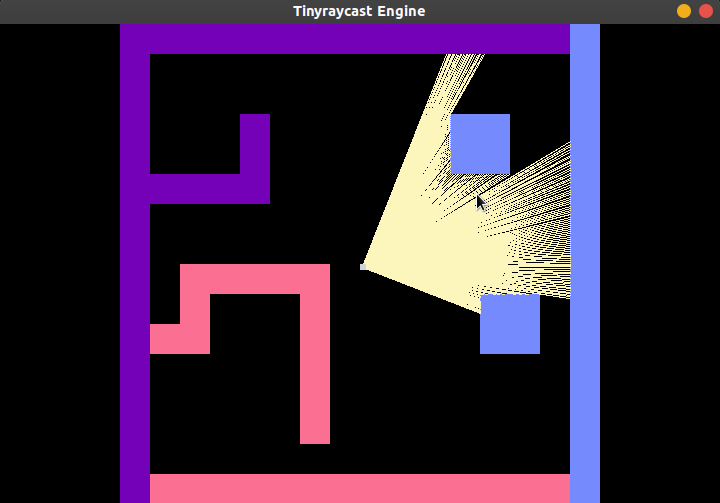
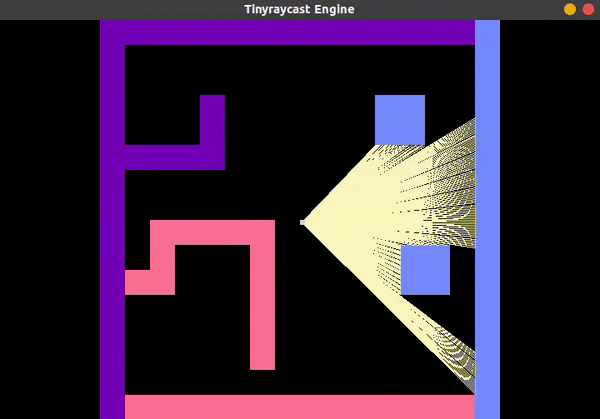
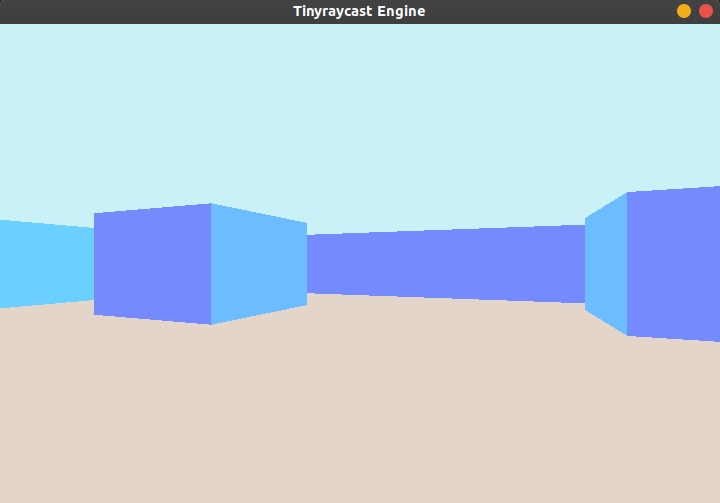
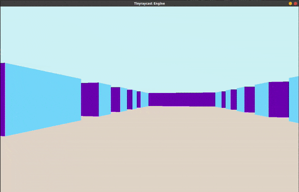
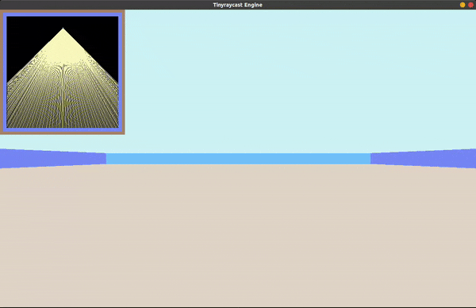

# tinyraycast

This is currently a simple raycasting engine that uses raycast and projection to turn a 2d space into a 3d first-person-view environment.

## Demo
### Web Demo
Checkout the web demo at https://jwcheng28.github.io/tinyraycast/

### 2D view

Stationary | Moving
--- | ---
 |  

### 3D view

Stationary | Moving
--- | ---
 |  

### 3D view with 2D minimap
 

### Editor Mode
 

## Controls
- Up/Down arrow keys to move back and forth
- Left/Right arrow keys to move left and right
- W/S to turn up and down
- A/D to turn left and right
- Space to toggle 2d raycast minimap
- E to enter editor mode, let's you draw on minimap
- N to exit editor mode

## Build
Currently, the engine is only tested and supported on ubuntu platform.
### Ubuntu
Run the following commands:

Currently, the only dependency is SDL2, you can get it on ubuntu by running `sudo apt-get install libsdl2-dev`

Compile the program by running the Makefile `make`, then run it make running `make run`
