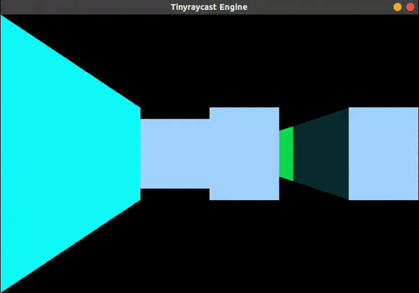

# tinyraycast

This is currently a simple raycasting engine that uses raycast and projection to turn a 2d space into a 3d first-person-view environment.

## Demo
### Still

### Movement

## Build
Currently, the engine is only tested and supported on ubuntu platform.
### Ubuntu
Run the following commands:

Currently, the only dependency is SDL2, you can get it on ubuntu by running `sudo apt-get install libsdl2-dev`

Compile and run the program by running the Makefile `make`
